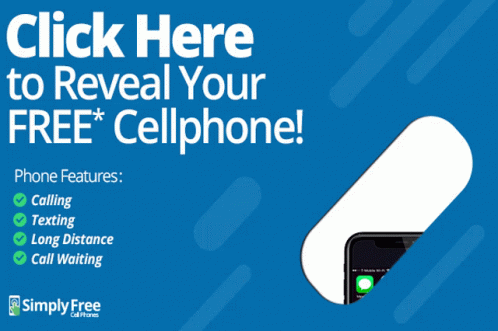

# 🎣 Le phishing

<figure><figcaption></figcaption></figure>

## C'est quoi le phishing ?

Le phishing sur internet est une forme de fraude en ligne où des escrocs envoient des courriels ou des messages instantanés qui semblent provenir de sources fiables (comme une banque ou un service en ligne populaire) dans le but d'obtenir des informations personnelles sensibles (comme des mots de passe ou des numéros de carte de crédit) ou de convaincre les utilisateurs de visiter un site Web malveillant. Les escrocs utilisent souvent des techniques de manipulation pour tromper les utilisateurs en leur faisant croire qu'ils ont besoin de fournir des informations urgentes pour éviter des conséquences négatives (comme la fermeture de leur compte bancaire). Il est donc important de rester vigilant et de ne pas fournir des informations personnelles à des sources inconnues ou suspectes.

## Les menaces

Les menaces liées au phishing comprennent:

1. **Vol d'identité** : Les cybercriminels peuvent utiliser les informations obtenues lors d'une attaque de phishing pour se faire passer pour leur victime et effectuer des transactions frauduleuses.
2. **Escroquerie financière** : Les cybercriminels peuvent utiliser les informations obtenues lors d'une attaque de phishing pour accéder aux comptes bancaires et cartes de crédit de leur victime et effectuer des transactions illégales.
3. **Installation de logiciels malveillants** : Les cybercriminels peuvent utiliser les courriels de phishing pour inciter les utilisateurs à cliquer sur des liens malveillants qui installent des logiciels malveillants sur leurs ordinateurs.
4. **Perte de données confidentielles** : Les cybercriminels peuvent utiliser les informations obtenues lors d'une attaque de phishing pour accéder aux systèmes d'une entreprise et voler des données sensibles.

En résumé, Les menaces liées au phishing sont le vol d'identité, l'escroquerie financière, l'installation de logiciels malveillants et la perte de données confidentielles.

### Comment se protéger ?

Il existe plusieurs moyens de se protéger contre les attaques de phishing :

1. Soyez méfiant envers les courriels et les messages qui vous demandent des informations sensibles, même s'ils semblent provenir d'une entreprise de confiance ou d'un ami.
2. Ne cliquez pas sur les liens dans les courriels ou les messages que vous suspectez d'être des tentatives de phishing. Au lieu de cela, saisissez l'URL de l'entreprise dans votre navigateur pour vous rendre sur son site.
3. Utilisez une application de sécurité qui vous protège contre les courriels de phishing et les logiciels malveillants.
4. Utilisez un gestionnaire de mots de passe pour créer et stocker des mots de passe forts pour tous vos comptes.
5. Utilisez deux facteurs d'authentification pour vous protéger contre les tentatives de phishing qui ciblent vos informations de connexion.
6. Soyez vigilant quant à l'utilisation de vos informations personnelles et financières sur internet et réagissez rapidement si vous remarquez des activités suspectes sur vos comptes.
7. Soyez informé des dernières techniques de phishing et des entreprises qui sont ciblées, ainsi vous pourrez être plus vigilant.

En résumé, Pour se protéger contre le phishing il est important d'être méfiant envers les courriels et les messages qui vous demandent des informations sensibles, ne pas cliquer sur les liens suspects, utiliser une application de sécurité, utiliser un gestionnaire de mots de passe et 2 facteurs d'authentification, être vigilant quant à l'utilisation de vos informations personnelles et financières sur internet et être informé des dernières techniques de phishing.
