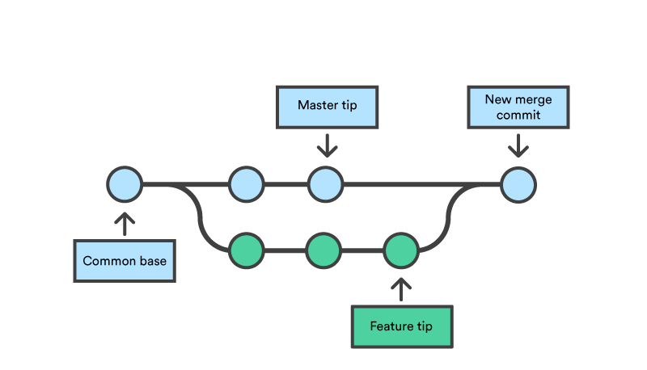

# 📑 Introduction


### Introduction dans l'utilisation de Github, le monde de l'open source à la portée de tous.

Github est un outil populaire et puissant pour la gestion de versions de code et la collaboration en équipe. Il peut vous aider à améliorer votre workflow de développement en vous permettant de travailler sur des projets en équipe, de suivre les bugs et les demandes de fonctionnalités, de gérer les accès et les permissions, de documenter et de communiquer sur vos projets. Il peut également vous aider à découvrir de nouveaux projets et à contribuer à des projets open-source.

Cependant, il est important de noter que Github n'est qu'un outil parmi d'autres et il dépendra de votre utilisation de l'adapter à votre workflow de développement et à vos besoins en matière de collaboration. Il est donc possible qu'il vous aide efficacement dans votre travail.

### 10 fonctionnalités principales de Github:

* Gestion de versions pour le code source
* Collaboration en temps réel sur des projets
* Suivi des bugs et des demandes de fonctionnalités
* Intégration continue et déploiement
* Création de branches et fusion de code
* Analyse de code et revue de code
* Gestion des accès et des permissions
* Outils de documentation et de communication
* Possibilité de créer des dépôts privés et publics
* Intégration avec d'autres outils de développement populaires.

### Premiers pas sur Github avec Git

Pour faire ses premiers pas sur Github, voici les étapes à suivre :

* Créez un compte sur Github en vous rendant sur https://github.com/join.
* Téléchargez et installez Git sur votre ordinateur en vous rendant sur https://git-scm.com/downloads.
* Configurez Git en entrant vos informations d'utilisateur, comme votre nom d'utilisateur et votre adresse e-mail, en utilisant les commandes suivantes :

```bash
git config --global user.name "Your Name"
git config --global user.email "your.email@example.com"
```

* Créez un nouveau dépôt (repository) en cliquant sur le bouton "New repository" sur votre page d'accueil de Github.
* Initialisez un dépôt local en utilisant la commande suivante dans le répertoire de votre projet :

```
git init
```

* Ajoutez dans ce dossier un ou plusieurs fichiers de tests. Par exemple un fichier "test.txt" avec un message a l'intérieur
* Ajoutez des fichiers à votre dépôt local en utilisant la commande suivante :

```bash
git add .
```

* Faites un commit de vos fichiers ajoutés en utilisant la commande suivante :

```
git commit -m "Initial commit"
```

* Connectez votre dépôt local à votre dépôt Github en utilisant la commande suivante (remplacez "your-repo" par le nom de votre dépôt) :

```
git remote add origin https://github.com/your-username/your-repo.git
```

* Envoyez (push) vos commits à votre dépôt Github en utilisant la commande suivante :

```
git push -u origin main
```

Et voilà, vous avez maintenant un dépôt Github et vous pouvez commencer à travailler sur vos projets en collaboration avec d'autres utilisateurs de Github !

### Une branche ? wait, il est ou l'arbre ?

<figure><figcaption></figcaption></figure>

En utilisant Git, il est possible de travailler sur plusieurs versions d'un projet en même temps en utilisant des branches.

Une branche est essentiellement un pointeur qui suit l'évolution d'un ensemble de commits sur un dépôt. Chaque dépôt Git a une branche principale appelée "master" qui est utilisée pour stocker la version finale et stable du projet. Les utilisateurs peuvent créer des branches supplémentaires pour travailler sur des fonctionnalités spécifiques, corriger des bugs ou expérimenter avec des idées sans risquer de perturber le code sur la branche principale.

Il est possible de créer des branches à partir de n'importe quel commit existant, de travailler dessus, de les fusionner avec d'autres branches et de les supprimer. Cela permet une grande flexibilité et une meilleure collaboration entre les développeurs.

Il est également possible de créer des branches à distance sur Github, ce qui permet aux utilisateurs de partager leur travail en cours avec d'autres utilisateurs avant de les fusionner avec la branche principale.

### Stars ? Fork ? Kékécé ?

<figure><figcaption></figcaption></figure>

Sur Github, les utilisateurs peuvent "étoiler" (en anglais "star") des dépôts (repositories) pour indiquer qu'ils les apprécient ou qu'ils les trouvent utiles. Cela permet aux autres utilisateurs de découvrir des dépôts populaires ou intéressants. Les étoiles sont publiques, c'est-à-dire que tout le monde peut voir combien de personnes ont étoilé un dépôt.

Un "fork" est une copie d'un dépôt existant dans votre propre compte Github. Cela permet aux utilisateurs de contribuer à un projet en proposant des modifications ou des améliorations via une demande de fusion (pull request). Un utilisateur peut également créer un fork pour avoir une copie du dépôt pour une utilisation personnelle.

En somme, les étoiles permettent de montrer votre appréciation pour un dépôt, tandis que les forks permettent de contribuer ou de copier un dépôt pour une utilisation personnelle.

### Octocat 🐙

Octocat est le nom de l'animal mascotte de Github. Il s'agit d'un chat à huit tentacules. Il a été créé par Simon Oxley, un illustrateur indépendant, pour le lancement de Github en 2007. Octocat est souvent utilisé pour représenter Github dans les illustrations et les logos et est devenu un symbole populaire pour la communauté de développeurs. Il apparait sur leur site web, sur leur documentation, sur leurs supports de communication, sur leurs goodies et sur les badges de profil des utilisateurs. Il est aussi fréquemment utilisé pour créer des illustrations humoristiques ou des memes dans la communauté de développeurs.

Tu veux créer ton propre octocat ? tu peux aller [ici](https://myoctocat.com/).
