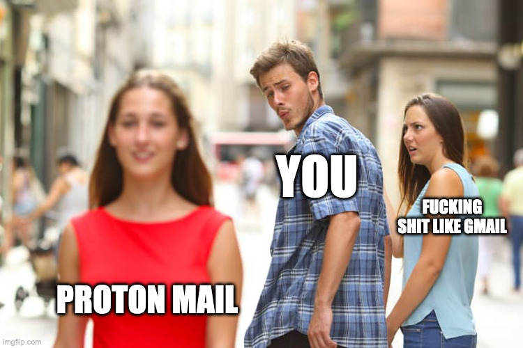

# Proton.me


Explore proton mail


### Proton c'est cool, mais qu'est-ce que c'est ?

ProtonMail est une suite complète de services en ligne axée sur la sécurité et la confidentialité. Leur boîte mail est un service de messagerie électronique chiffré de bout en bout qui offre une protection maximale des données. Avec ProtonMail, les utilisateurs peuvent envoyer et recevoir des courriels de manière sécurisée, sachant que leurs informations ne peuvent pas être interceptées ou consultées par des tiers non autorisés.

En plus de leur boîte mail, ProtonMail propose également un service VPN, qui permet aux utilisateurs de se connecter à Internet de manière privée et sécurisée, en cryptant toutes les données échangées entre leur ordinateur et le serveur VPN. Cela garantit que les utilisateurs peuvent naviguer sur le Web sans laisser de traces et sans être surveillés par des tiers.

ProtonMail propose également un agenda en ligne, qui permet aux utilisateurs de planifier leur emploi du temps de manière organisée et efficace. L'agenda est également sécurisé, de sorte que les utilisateurs peuvent stocker des informations sensibles en toute sécurité sans craindre qu'elles ne soient compromises.

Enfin, ProtonMail propose un service de stockage en nuage sécurisé, qui permet aux utilisateurs de stocker des fichiers en ligne en toute sécurité. Ce service utilise également un chiffrement de bout en bout pour garantir que les fichiers ne peuvent pas être consultés ou volés par des tiers non autorisés.

Dans l'ensemble, la suite ProtonMail est un ensemble de services de qualité supérieure qui offrent une sécurité et une confidentialité maximales pour les utilisateurs qui sont soucieux de la protection de leurs données en ligne.

### Mise en situation

**Alice**: Salut Elena, comment vas-tu ? J'aimerais te parler d'un service que j'utilise et que je pense que tu devrais essayer aussi. As-tu déjà entendu parler de ProtonMail ?

**Elena**: Non, je n'en ai jamais entendu parler. Qu'est-ce que c'est ?

**Alice**: C'est un service de messagerie en ligne sécurisé qui utilise le chiffrement de bout en bout. Cela signifie que personne ne peut accéder à tes courriels sauf toi. C'est parfait pour ceux qui sont soucieux de leur vie privée en ligne.

**Elena**: Ah, intéressant. Mais je suis déjà satisfait de ma messagerie actuelle.

**Alice**: Mais attends, ce n'est pas tout. Ils ont également un service VPN qui te permet de naviguer sur Internet de manière anonyme et sécurisée. Tu peux même accéder à des sites web bloqués dans certains pays.

**Elena**: Vraiment ? Je suis curieuse. Et qu'en est-il de la facilité d'utilisation ?

**Alice**: C'est très simple à utiliser, et leur interface est très intuitive. En outre, ils offrent également un agenda en ligne et un service de stockage en cloud sécurisé. Tout est intégré en une seule plateforme, c'est très pratique.

**Elena**: Hmm, ça a l'air plutôt intéressant. Combien ça coûte ?

**Alice**: Ils ont une version gratuite, mais je recommande vraiment la version Premium pour avoir accès à toutes les fonctionnalités. C'est seulement quelques euros par mois, mais c'est vraiment un excellent investissement pour la sécurité de tes données.

**Elena**: D'accord, tu m'as convaincue. Je vais essayer la version Premium. Merci pour la recommandation, Alice !


Get proton


<figure><figcaption></figcaption></figure>
