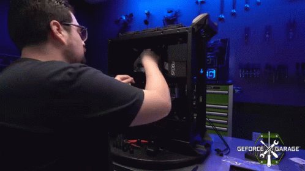

# Les unités informatiques

Il existe plusieurs unités informatiques qui sont essentielles pour construire un ordinateur fonctionnel. Les principales unités sont :

1. Unité centrale de traitement (Central Processing Unit, CPU) : C'est le cerveau de l'ordinateur, qui exécute les instructions du logiciel. Il est généralement composé d'un ou plusieurs cœurs qui peuvent exécuter des instructions simultanément.
2. Mémoire vive (Random Access Memory, RAM) : C'est la mémoire temporaire utilisée par le CPU pour stocker les données et les instructions en cours d'exécution. La RAM est généralement de type volatile, c'est-à-dire qu'elle perd ses données lorsque l'ordinateur est éteint.
3. Disque dur (Hard Disk Drive, HDD) ou Unité de stockage à Etat Solide (Solid-State Drive, SSD) : C'est le support de stockage principal pour les données et les programmes. Les disques durs sont généralement de type mécanique, alors que les SSD sont de type électronique. Les disques durs ont des capacités de stockage plus élevées mais ont des accès plus lents aux données, tandis que les SSD ont des accès plus rapides mais des capacités de stockage plus faibles.
4. Carte mère (Motherboard) : C'est la carte principale qui relie tous les composants de l'ordinateur entre eux. Elle comporte des ports pour connecter les différents périphériques, des connecteurs pour la RAM, le CPU, le disque dur, etc.
5. Carte graphique (Graphics Processing Unit, GPU) : C'est une unité informatique dédiée aux calculs graphiques. Elle est utilisée pour afficher les images et les vidéos sur l'écran.
6. Alimentation électrique (Power Supply Unit, PSU) : C'est l'unité qui fournit de l'électricité aux différents composants de l'ordinateur.
7. Boîtier (Case) : C'est l'enveloppe physique qui contient tous les composants de l'ordinateur. Il protège les composants de la poussière et des chocs, et permet d'installer les différents périphériques.

Il existe également d'autres unités informatiques comme les périphériques d'entrée et de sortie (clavier, souris, écran, etc.), les dispositifs de stockage amovibles (clés USB, disques durs externes, etc.), les réseaux (cartes réseau, modems, routeurs, etc.) et les périphériques de saisie (scanners, appareils photo, etc.).

<figure><figcaption></figcaption></figure>

## Quizz



1. Qu'est-ce qu'une unité centrale de traitement (CPU) ?
2. Qu'est-ce qu'une carte mère ?
3. Qu'est-ce qu'une mémoire vive (RAM) ?&#x20;
4. Qu'est-ce qu'un disque dur (HDD) ?
5. Qu'est-ce qu'une carte graphique (GPU) ?



1. La CPU est le cerveau de l'ordinateur, responsable de l'exécution des instructions et des calculs.
2. La carte mère est le composant principal d'un ordinateur qui relie tous les autres composants et permet la communication entre eux.
3. La RAM est un type de mémoire temporaire utilisé par l'ordinateur pour stocker les données et les instructions en cours d'exécution.
4. Un disque dur est un composant de stockage de masse utilisé pour stocker les données et les programmes sur un ordinateur.
5. La GPU est un composant dédié pour traiter les tâches graphiques intensives, telles que les jeux et la vidéo.


