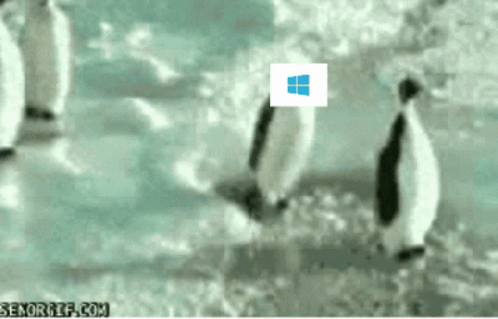

# Caractéristiques de GNU/Linux

Les systèmes d'exploitation GNU/Linux ont plusieurs caractéristiques générales qui les distinguent des autres systèmes d'exploitation tels que Windows et macOS. Voici quelques-unes des caractéristiques les plus importantes :

1. Logiciel libre et open-source : Les systèmes d'exploitation GNU/Linux sont basés sur le logiciel libre et open-source, ce qui signifie que le code source est disponible pour tous et peut être modifié et distribué librement. Cela permet aux utilisateurs de personnaliser leur système d'exploitation selon leurs besoins.
2. Terminal de commande : Les systèmes d'exploitation GNU/Linux ont un terminal de commande intégré qui permet aux utilisateurs de saisir des commandes pour effectuer des tâches spécifiques. Cela peut sembler intimidant au début, mais cela donne aux utilisateurs un contrôle plus fin sur leur système.
3. Système de fichiers en arborescence : Les systèmes d'exploitation GNU/Linux utilisent un système de fichiers en arborescence qui organise les fichiers et les dossiers de manière hiérarchique. Il est similaire à la structure de dossiers dans Windows et macOS, mais il est plus flexible.
4. Gestionnaire de paquets : Les systèmes d'exploitation GNU/Linux ont un gestionnaire de paquets intégré qui permet aux utilisateurs d'installer, désinstaller et mettre à jour facilement les logiciels. Cela simplifie grandement le processus d'installation des logiciels sur le système.
5. Communauté active : La communauté de développeurs et d'utilisateurs de GNU/Linux est très active, il existe donc une grande quantité de documentation, de tutoriels et de forum pour les aider à résoudre des problèmes et à personnaliser leur système.
6. Sécurité : Les systèmes d'exploitation GNU/Linux sont généralement considérés comme plus sûrs que les systèmes d'exploitation propriétaires tels que Windows et macOS, car leur code source est ouvert et peut être examiné par des développeurs de toutes les parties pour détecter les faiblesses de sécurité.
7. Multi-tâche : Les système d'exploitation GNU/Linux sont multi-tâche, cela signifie qu'il est possible d'exécuter plusieurs programmes simultanément sur le système.
8. Multi-utilisateur : Les systèmes d'exploitation GNU/Linux sont multi-utilisateurs, cela signifie que plusieurs utilisateurs peuvent utiliser le système simultanément, chacun ayant ses propres paramètres, préférences et autorisations. Cela permet à plusieurs personnes de partager un même ordinateur en toute sécurité.
9. Interopérabilité : Les systèmes d'exploitation GNU/Linux sont interopérables avec d'autres systèmes d'exploitation et peuvent lire et écrire des fichiers provenant de systèmes tels que Windows et macOS. Cela facilite la collaboration et l'échange de données entre différents systèmes d'exploitation.
10. Personnalisation : Les systèmes d'exploitation GNU/Linux offrent une grande flexibilité en matière de personnalisation. Il existe de nombreux thèmes et icônes disponibles pour personnaliser l'apparence du système d'exploitation, et de nombreux outils de personnalisation pour adapter les fonctionnalités et les paramètres selon les préférences de l'utilisateur.

Il est important de noter que ces caractéristiques varient légèrement en fonction de la distribution de GNU/Linux choisie. Il est donc important de consulter les caractéristiques spécifiques de la distribution avant de l'utiliser.

<figure><figcaption></figcaption></figure>


[pourquoi-linux.md](caracteristiques-de-gnu-linux/pourquoi-linux.md)

