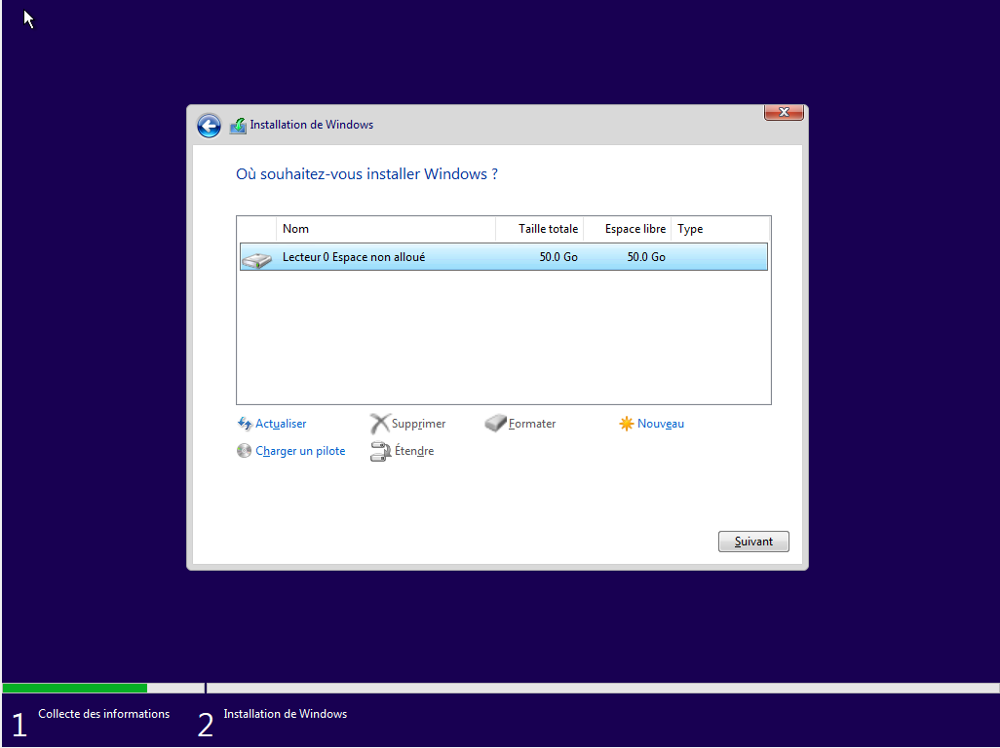

# 🪟 Installation Windows

Avec son interface graphique et ses options réduites au minimum, Windows est surement l'un des systèmes d'exploitation les plus simple à installer. Dans ce chapitre, nous aborderons l'installation de Windows (10 ou 11) depuis un support de stockage telle une clé USB, cette méthode étant la plus universelle. Cependant, vous pouvez aussi installer Windows au sein d'une machine virtuelle (VM) dans le cas d'une utilisation expérimentale, ou alors utiliser l'assistant d'installation fourni par Microsoft.

Une fois votre clé USB contenant Windows en main, branchez là sur un port USB disponible (de préférence 3.1 car plus rapide) et démarrez dessus \[Insérer liens vers tutoriels pour BalenaEtcher et Booter sur usb].

Lorsque elle est demandée, insérez votre clé de licence Windows si vous en possédez une, ou alors cliquez sur "Je n'ai pas de clé produit (Product Key)" si vous souhaitez utiliser une version limitée de Windows. Une fois cette étape terminée, sélectionnez votre version de Windows.

<figure><figcaption>
Clé de licence Windows
</figcaption></figure>

Une fois le chargement terminé, nous arrivons sur une fenêtre proposant d'installer ou réparer Windows. Sélectionnons la première option et nous pouvons choisir entre une mise à niveau ou une installation personnalisée de Windows. Nous souhaitons une installation neuve de Windows, donc nous sélectionnerons la seconde options. Choisissons maintenant sur quel support installer Windows. Ici, plusieurs situations sont possibles :

* Des partitions sont déjà présentes sur le disque. Dans ce cas, supprimez les toutes puis suivez le point prochain. <mark style="color:red;">**ATTENTION, SUPPRIMEZ LES PARTITIONS EFFACERA TOUTES LES DONNÉES PRÉSENTES SUR VOTRE PC DE MANIÈRE IRRÉVERSIBLE. SOYEZ SÛR D'AVOIR SAUVEGARDÉ TOUTES VOS DONNÉES SUR UN SUPPORT EXTERNE AVANT DE CONTINUER !**</mark>

<figure><figcaption></figcaption></figure>

* Le/Les disques ne contiennent pas de partitions. Le cas échéant, sélectionnez le disque vide (Lecteur X Espace non alloué) et cliquez sur suivant.

<figure><figcaption></figcaption></figure>

Windows s'installe, il ne reste plus qu'à patienter ! Votre ordinateur devrait redémarrer à plusieurs reprises.

Une fois l'installation terminée et votre ordinateur, on peut entamer la partie 2 : La configuration de Windows !

<figure><figcaption>
Sélection de la langue lors de la configuration de Windows 10
</figcaption></figure>

Sélectionnez la langue, la disposition du clavier, et patientez le temps du chargement. Une fois celui-ci terminé, Windows devrait vous demander de vous connecter, sans vous laisser le choix de passer cette étape (Merci Microsoft). Si vous ne souhaitez pas vous connecter à votre compte Microsoft <mark style="color:red;">**(Ce que nous recommandons fortement pour préserver votre vie privée)**</mark>, coupez votre connexion internet et cliquez sur Retour.

<figure><figcaption>
L'écran de connexion <del>insistant</del> de Microsoft
</figcaption></figure>

Renseingez votre nom, votre mot de passe, les nombreuses questions de sécurité, puis séléctionnez "Non", "Non", "Envoyer les données de diagnostic obligatoires", "Non", "Non", et enfin "Non" (Toujours afin de préserver votre vie privée). Patientez quelques instants et choisissez si vous souhaiter activer Cortana ou non (Encore une fois, nous déconseillons l'activation de Cortana si vous tenez à votre vie privée).

VOILÀ ! Windows est maintenant installé sur votre ordinateur. À présent, vous pouvez décider de l'utiliser comme tel ou de le nettoyer encore un peu afin de travailler avec un système plus léger et moins intrusif.

Pour conclure, <mark style="color:red;">**n'oubliez pas de mettre votre système à jour !**</mark> Certes, c'est  une procédure longue et contraignante avec Windows mais c'est un mal nécessaire si vous ne souhaitez pas voire vos données personnelles s'envoler dans la nature !
