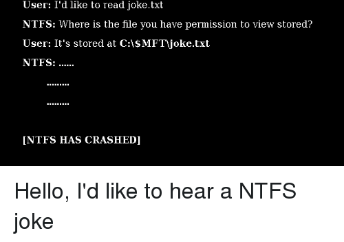

# Permissions NTFS

Les permissions NTFS (NT File System) sont utilisées pour contrôler l'accès aux fichiers et dossiers sur un système de fichiers NTFS. Il existe deux types de permissions : les permissions d'accès et les permissions d'audit.

Les permissions d'accès contrôlent qui peut lire, écrire, exécuter, supprimer ou accéder à un fichier ou un dossier. Il existe cinq types de permissions d'accès : lecture, écriture, exécution, suppression et contrôle total. Ces permissions peuvent être attribuées à des utilisateurs ou à des groupes d'utilisateurs individuellement ou par héritage.

Les permissions d'audit contrôlent quelles actions sont enregistrées dans les journaux d'audit. Il existe quatre types de permissions d'audit : succès, échec, succès et échec. Ces permissions peuvent également être attribuées à des utilisateurs ou à des groupes d'utilisateurs individuellement ou par héritage.

Il y a plusieurs principes à suivre pour configurer les permissions NTFS :

1. Les utilisateurs doivent avoir uniquement les permissions nécessaires pour accomplir leur travail. Il est important de ne pas donner aux utilisateurs des permissions superflues qui pourraient les mettre en danger.
2. Les permissions doivent être attribuées à des groupes d'utilisateurs plutôt qu'à des utilisateurs individuels. Cela facilite la gestion des permissions et réduit les erreurs.
3. Les permissions doivent être héritées de manière à éviter des configurations redondantes. Cela simplifie la gestion des permissions et évite les erreurs.
4. Les utilisateurs doivent être ajoutés à des groupes d'utilisateurs appropriés pour leur rôle. Il est important de ne pas ajouter des utilisateurs à des groupes qui leur donnent des permissions superflues.
5. Les permissions d'audit doivent être configurées pour surveiller les actions des utilisateurs. Il est important de surveiller les actions des utilisateurs pour détecter les tentatives d'accès non autorisées.

Il est important de noter que les permissions NTFS sont cumulatives, ce qui signifie que les permissions d'un utilisateur ou d'un groupe d'utilisateurs s'additionnent. Il est également important de comprendre les principes de l'héritage des permissions pour éviter des conflits de permissions. Il est important de conserver une documentation à jour des permissions NTFS pour faciliter la gestion des permissions.

## Exercices :&#x20;

1. Créez un nouveau dossier sur votre ordinateur et donnez-lui un nom, par exemple "Exercice NTFS 1". Ensuite, attribuez des permissions de lecture à un utilisateur ou un groupe d'utilisateurs. Vérifiez que l'utilisateur ou le groupe d'utilisateurs peut ouvrir et lire les fichiers dans le dossier.
2. Créez un nouveau fichier dans le dossier "Exercice NTFS 1" et donnez-lui un nom, par exemple "fichier 1". Ensuite, attribuez des permissions d'écriture à un utilisateur ou un groupe d'utilisateurs différents de ceux qui ont des permissions de lecture. Vérifiez que l'utilisateur ou le groupe d'utilisateurs peut ouvrir, lire et écrire dans le fichier.
3. Créez un nouveau sous-dossier dans le dossier "Exercice NTFS 1" et donnez-lui un nom, par exemple "sous-dossier 1". Ensuite, attribuez des permissions d'exécution à un utilisateur ou un groupe d'utilisateurs. Vérifiez que l'utilisateur ou le groupe d'utilisateurs peut exécuter les fichiers exécutables dans le sous-dossier.
4. Créez un nouveau fichier dans le sous-dossier "sous-dossier 1" et donnez-lui un nom, par exemple "fichier 2". Ensuite, attribuez des permissions de suppression à un utilisateur ou un groupe d'utilisateurs. Vérifiez que l'utilisateur ou le groupe d'utilisateurs peut supprimer le fichier.
5. Créez un nouveau dossier sur votre ordinateur et donnez-lui un nom, par exemple "Exercice NTFS 2". Ensuite, attribuez des permissions d'accès complet à un utilisateur ou un groupe d'utilisateurs. Vérifiez que l'utilisateur ou le groupe d'utilisateurs peut lire, écrire, exécuter, supprimer et accéder à tous les fichiers et dossiers dans le dossier.
6. Créez un nouveau sous-dossier dans le dossier "Exercice NTFS 2" et donnez-lui un nom, par exemple "sous-dossier 2". Ensuite, configurez l'héritage des permissions pour que les permissions du dossier parent soient automatiquement appliquées au sous-dossier. Vérifiez que les permissions du dossier parent sont automatiquement appliquées au sous-dossier.
7. Créez un nouveau fichier dans le sous-dossier "sous-dossier 2" et donnez-lui un nom, par exemple "fichier 3". Ensuite, configurez des permissions spécifiques pour ce fichier qui diffèrent des permissions du dossier parent. Vérifiez que les permissions spécifiques sont appliquées uniquement à ce fichier et non au reste des fichiers dans le dossier parent.
8. Créez un nouveau groupe d'utilisateurs et ajoutez des utilisateurs à ce groupe. Ensuite, créez un nouveau dossier sur votre ordinateur et donnez-lui un nom, par exemple "Exercice NTFS 3". Enfin, attribuez des permissions au groupe d'utilisateurs au lieu d'attribuer des permissions à chaque utilisateur individuellement. Vérifiez que les utilisateurs dans le groupe ont les permissions appropriées pour accéder aux fichiers et dossiers dans le dossier.

<figure><figcaption></figcaption></figure>
